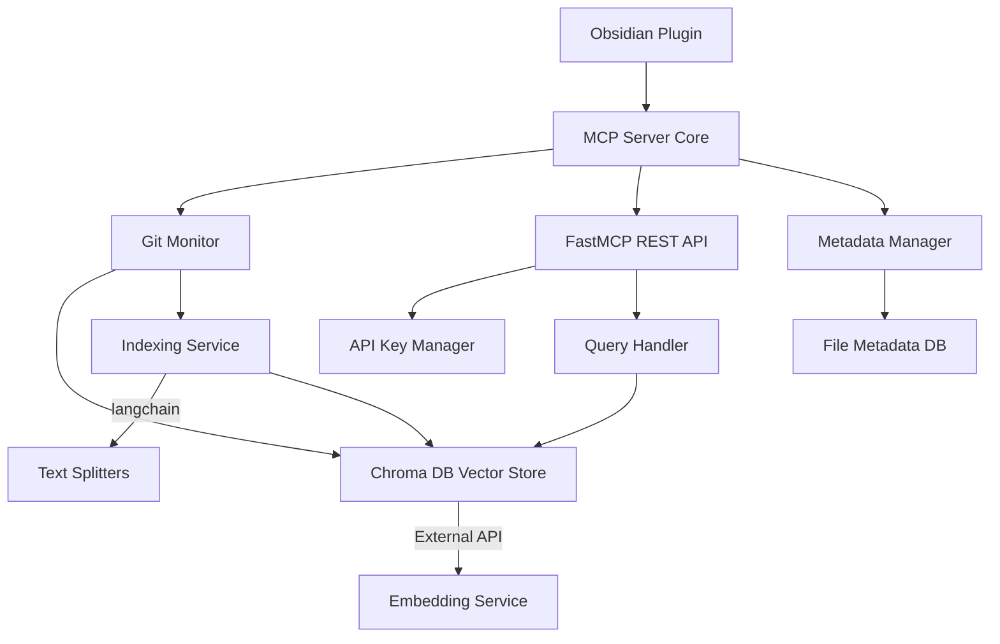

# Obsidian MCP Server with RAG and FastMCP API - Architecture

## Overview

This document outlines the revised architecture for an Obsidian plugin that implements:

1. MCP server functionalities
2. Git-based RAG system with Chroma DB
3. FastMCP REST API
4. File metadata system
5. External API embeddings
6. Langchain text splitters

## Core Components

### 1. MCP Server Core
- Plugin lifecycle management
- Service coordination
- Settings configuration
- Error handling and logging

### 2. Git Monitor
- Watches for git commit events
- Maintains list of non-gitignored files
- Triggers reindexing on changes
- Tracks file change history

### 3. RAG System with Chroma DB
**Vector Store:**
- Chroma DB implementation
- Stores document embeddings
- Supports similarity search
- Versioned storage for rollback

**Indexing Service:**
- Processes file content using langchain text splitters
- Generates embeddings via external API
- Maintains index freshness

### 4. FastMCP REST API
**API Key Manager:**
- Per-vault key generation
- Key revocation
- Usage tracking

**Query Handler:**
- Natural language processing
- Metadata-enhanced search
- Result ranking

### 5. Metadata Manager
- File metadata storage
- Tag management
- Search optimization
- Custom field support

## Implementation Plan

1. **Phase 1: MCP Server & FastMCP Setup**
   - Core MCP server implementation
   - FastMCP REST API integration
   - Basic API endpoints for testing

2. **Phase 2: Chroma DB & Text Processing**
   - Chroma DB vector store setup
   - langchain-community text splitters integration
   - External embedding API configuration

3. **Phase 3: Git Monitoring & Indexing**
   - Git change detection
   - Document processing pipeline
   - Vector store updates

4. **Phase 4: Metadata & Advanced Features**
   - File metadata system
   - Query enhancements
   - UI integration

## Dependencies
- Obsidian API
- Chroma DB
- FastMCP
- langchain-community
- External embedding API (e.g., OpenAI, HuggingFace)